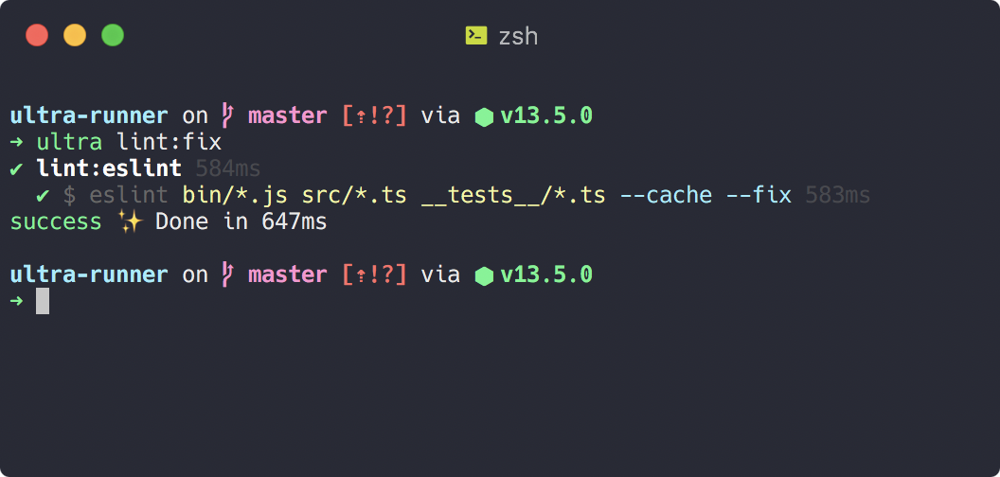
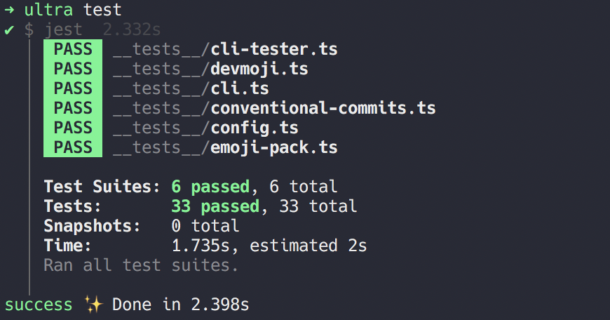
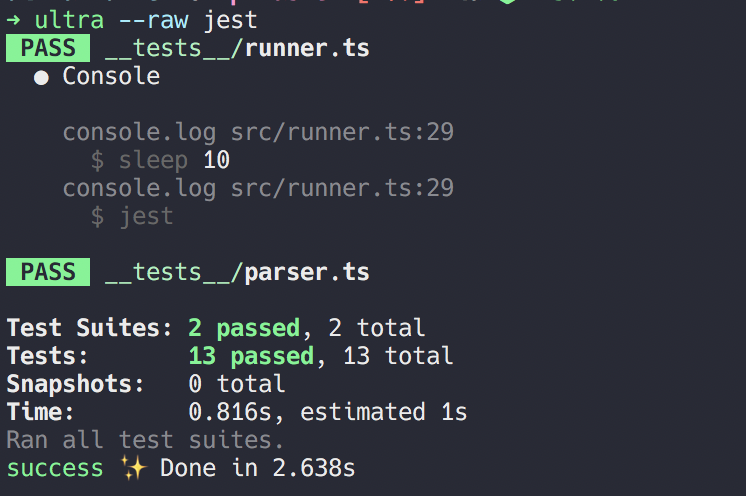

# :runner: :mountain: Ultra Runner

[](https://github.com/folke/ultra-runner/actions?query=workflow%3A%22Node+CI%22) [](https://coveralls.io/github/folke/ultra-runner?branch=master) [](https://www.npmjs.com/package/ultra-runner) [](https://github.com/folke/ultra-runner/blob/master/LICENSE) [](https://github.com/folke/ultra-runner/) [](https://renovatebot.com)

**Smart** and **beautiful** script runner that hijacks any `npm run`, `yarn` and `npx` calls for **ultra** fast execution.


## :question: Why

Use one command to run package scripts, locally installed binaries or system binaries

|                        | `npm run`          | `npx`              | `yarn`             | `yarn exec`        | `ultra`            |
| ---------------------- | ------------------ | ------------------ | ------------------ | ------------------ | ------------------ |
| `package.json` scripts | :white_check_mark: | :x:                | :white_check_mark: | :x:                | :white_check_mark: |
| `./node_modules/.bin/` | :x:                | :white_check_mark: | :white_check_mark: | :white_check_mark: | :white_check_mark: |
| system binaries        | :x:                | :white_check_mark: | :x:                | :white_check_mark: | :white_check_mark: |

### :nerd_face: Smart

**Ultra** parses your `package.json` and hijacks any `npm run`, `yarn` and `npx` calls.
Shell operators like `&&`, `;` and `||` are also interpreted.

For example:

```json
{
  "scripts": {
    "lint": "yarn lint:ts && yarn lint:eslint && yarn lint:docs",
    "lint:eslint": "npx eslint bin/*.js src/*.ts __tests__/*.ts --cache",
    "lint:docs": "npx markdownlint README.md",
    "lint:ts": "npx tsc -p tsconfig.build.json --noEmit",
    "lint:fix": "yarn lint:eslint --fix"
  }
}
```

Running `ultra lint`


Running `ultra lint:fix` will spawn exactly **one** child process, directly with the correct command, instead of spawning `yarn` intermediately


**Ultra** will additionally execute any configured `pre` and `post` scripts, just like `npm run` and `yarn run`.

### :zap: Ultra Fast

**Ultra** parses your `package.json` scripts and will only execute the commands that are really needed. Any script interdependencies are resolved during the parsing stage.
This ensures there's pretty much no overhead in execution by **Ultra** itself, since it's only running once.
`yarn run` or `npm run` on the other hand, will spawn new `yarn` or `npm` child processes as needed by the package scripts.

|                          | `npm run` | `npx` | `yarn` | `yarn exec` | `ultra` |
| ------------------------ | --------- | ----- | ------ | ----------- | ------- |
| execution overhead _(1)_ | 250ms     | 60ms  | 220ms  | 200ms       | 80ms    |

  <!-- markdownlint-disable MD033 -->

> <sup>**1.** each program was run 10x with the command `true` or `{scripts:{"true":"true}}` to calculate the execution overhead</sup>

Suppose you would want to run a script that calls 5 other scripts by using `&&` and/or `post`/`pre`.

- Using `yarn`, you would have a total overhead of **2.5s** _(10x 250ms)_
- Using `ultra`, you hit the overhead only once, so the total overhead would still be **80ms**

To make execution **ultra** fast, you can [configure](##gear-optional-configuration) which `scripts` should be ran concurrently.

> :grey_exclamation: there's no need to **switch** your scripts over to **ultra**. Even with the optional configuration you can still use `yarn` or `npm` to run your scripts if you want to.

Example builds:

|                                                             | `yarn` | `ultra` not concurrent | `ultra` concurrent |
| ----------------------------------------------------------- | ------ | ---------------------- | ------------------ |
| build [Ultra-Runner](https://github.com/folke/ultra-runner) | 8.9s   | 7.2s                   | 5.1s               |
| build [Devmoji](https://github.com/folke/devmoji)           | 16s    | 13s                    | 8s                 |

### :princess: Beautiful

There are three output formats that each can be combined with `--silent` to hide command output.

`--fancy` is the default. It shows output in a hieracrhical way and uses spinners to see exactly what's happening.
Make sure to check out the animation at the top of this page as well. Every executed step shows the execution time.


`--fancy` combined with `--silent` is useful if you're only interested to see the overview:


`--no-fancy` doesn't use spinners and prefixes command output with the command name. This is useful for logging purposes.


Combining `--no-fancy` with `--silent` shows a flat overview:


`--raw` will show the exact ouput as you would expect when running the commands stand alone. If the command you're executing is interactive (reads from stdin), then this is the mode you should use.


## :package: Installation

Install with `npm` or `yarn`

> globally

```sh
npm install -g ultra-runner
yarn global install ultra-runner
```

> locally inside your project. use with `npx ultra`

```shell
npm install --dev ultra-runner
yarn add --dev ultra-runner
```

See [optional configuration](##gear-optional-configuration) for information on how to setup concurrent script execution.

## :rocket: Usage

```console
$ ultra --help
Usage: ultra [options]

Options:
  -c|--concurrent  Run the given commands concurrently
  -p|--parallel    alias for --concurrent
  --fancy          enable fancy output, spinners and seperate command output. Default when a TTY (default: true)
  --no-fancy       disables fancy output, spinners and seperate command output. Default when not a TTY. Useful for logging
  --raw            Output only raw command output
  -s|--silent      skip script output. ultra console logs will still be shown
  --color          colorize output (default: true)
  --no-color       don't colorize output
  -d|--dry-run     output what would be executed
  -v|--version     output the version number
  -h, --help       output usage information
```

- use `--concurrent` to quickly run some commands in parallel. Any of the commands below are valid:
  - `ultra --concurrent lint \; test \; build`
  - `ultra --concurrent "lint ; test ; build"`
  - `ultra --concurrent "lint && test && build"`
- use `--dry-run` to see what would be executed. The output is similar to `--fancy --silent`

## :gear: Optional Configuration

To allow parallel execution of your scripts, you can specify scripts that should run concurrently,
in your `package.json`.

```json
{
  "scripts": {
    "lint:eslint": "npx eslint bin/*.js src/*.ts __tests__/*.ts --cache",
    "lint:docs": "npx markdownlint *.md",
    "lint:ts": "npx tsc -p tsconfig.build.json --noEmit",
    "lint": "yarn lint:eslint && yarn lint:docs && yarn lint:ts",
    "prebuild": "yarn lint && yarn jest",
    "build": "..."
  },
  "ultra": {
    "concurrent": ["lint"]
  }
}
```

- `yarn build` will run the `lint` and `jest` commands sequentially
- `ultra build` will run all `lint` commands concurrently and then execute `jest`. (note that we can also add `prebuild` to `concurrent`, since tests don't depend on linting. this way all commnands would run concurrently)

Notice how the sum of execution times of the seperate lint commands is lower than the total time:

